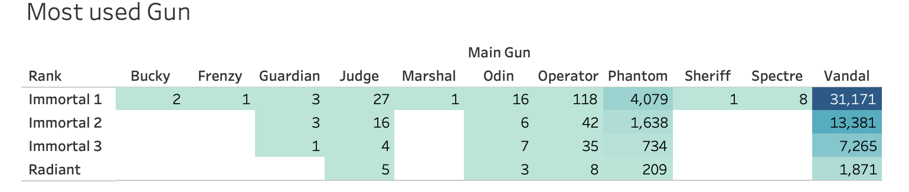
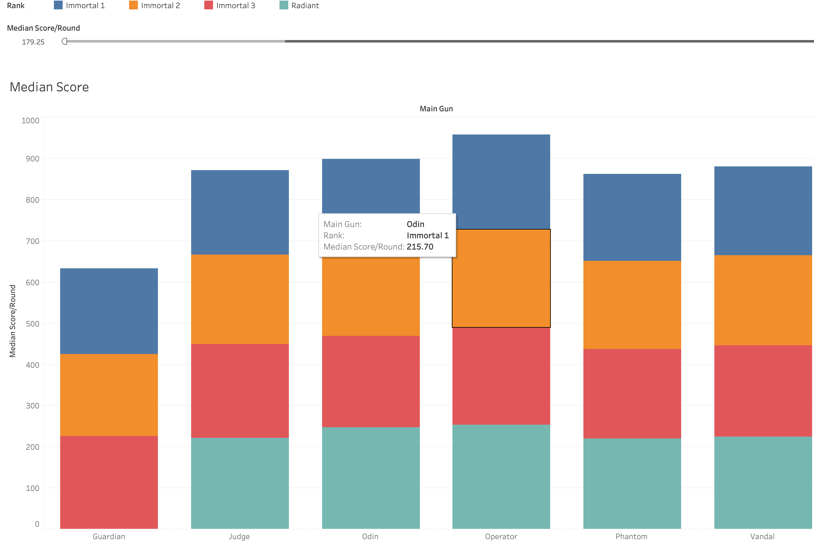

<H1> DATA 301 Term Project - Group 64
<H3> Tyler Cummings, Karam Hejazin, Brandon Mac 

 
 

 <H3> Introduction 

   Our term project is focused on the popular online first-person shooter video game, Valorant. We are all gamers and this game is very popular with a large array of statistics available to its players. Our group was passionate about exploring the intricacies of Valorant's top players, guns and characters. This project has allowed us to dive deeper into Valorant and analyze the aforementioned topics. We aim to provide insights into each of our topics and hopefully help other players understand some of the underlying statistics of the game to help them improve.

 <H3> Paragraph 1 

The research question I investigated was: How does character usage differ across regions in Valorant, and is there a relationship between character usage and player rank?

To answer this question, I analyzed data from the top Valorant players worldwide, focusing on their region, rank, and preferred agents.

One visualization that helped me answer this question is a bar chart showing the distribution of agents used across different regions. From this visualization, I observed that Chamber and Viper are the most commonly used agents across all regions, while Phoenix and Cypher are the least popular.

Another visualization that helped me answer this question is a bar chart showing the relationship between player rank and the most commonly used agent. From this visualization, I observed that Chamber is the most commonly selected agent by rank, with only slight variations between different ranks.

Finally, a bar chatshowing the frequency of agent usage across different ranks provided insight into the most and least picked agents in the game. From this visualization, I observed that Yoru, Cypher, and Phoenix are the least picked agents across all ranks, while Chamber and Viper are the most commonly picked.

Overall, my analysis suggests that there are some regional differences in agent usage in Valorant, but these differences are not substantial. The most popular agents across all regions and ranks are Chamber and Viper, while the least popular agents are Yoru, Cypher, and Phoenix. Additionally, there is not much variation in agent meta across different ranks. 

 <H3> Paragraph 2 

My research question was: Which guns are the most used in the highest ranks and why they are the most used? I started by first finding the number of games played by each gun by each of the 4 top ranks. You can see the results in the table below.

These findings helped me narrow down the gun choices that are even being played at all, we finally kept just 5 of the guns plus gaurdian as it was an interesting outlier to look at. I then look at the gun damage and score of each of the guns to see which guns are the most effective. You can see the results in the graphs below.

   

The data shows that the Operator and Odin are high damage weapons that are commonly used by high-ranked players in Valorant due to their high dps. However, the Operator has a slower fire rate and the highest cost, while the Odin has a slower movement speed and is more situational. Despite this, the Vandal is the most consistent weapon across all ranks and is the most used in the game. This suggests that players prioritize consistency and reliability over raw power and that the Vandal is a versatile weapon that can be used effectively in various situations.

It is important to note that these findings are based on the current state of the game and that the weapon meta can shift from act to act as the game updates and balance changes are made. Therefore, it is important for players to stay up to date on the latest changes and adapt their playstyle accordingly to remain competitive in the game.

All in all, i'd say that the reason certain weapons are better than others is just consistency. The highest ranked players are always looking to perform and that is offered with some guns more tha others.

 <H3> Paragraph 3 

   Brandon's research question was as follows; "What is the relationship between a player's weapon preferences, their accuracy with said weapons and their overall performance in terms of kills, wins and their rating in competitive play. How will these relationships differ across the ranks and as players get to a higher rank will there be a specific gun that players use to achieve this"
    
    

    
   This graph shows the accuracy for all guns in the game
    
    

   
   This graph shows the average headshot percentage per rank
    
    

   The analysis was conducted on all rank levels as a comparison but focused mainly on the top Valorant players worldwide to see how they achieved their rank. The data was cleaned by removing irrelevant columns that were not relevant to the analysis being done. The visualizations created revealed that higher-ranked players did have higher headshot percentages, typically above 23% compared to their lower-ranked counterparts who had percentages around 10-15%. This is a significant statistic as a headshot in Valorant does the most damage and thus allows for the quickest kills. The most common guns used to achieve this were the Vandal and the Phantom which are both very popular due to their damage and accuracy. Overall the research question was explored in depth over the course of the project however there could have been better data cleaning and a more complex research question from the beginning. Lastly, the analysis provided insight into the relationship between a player's weapon preferences, accuracy and rank in Valorant.

 <H3> Conclusion 

